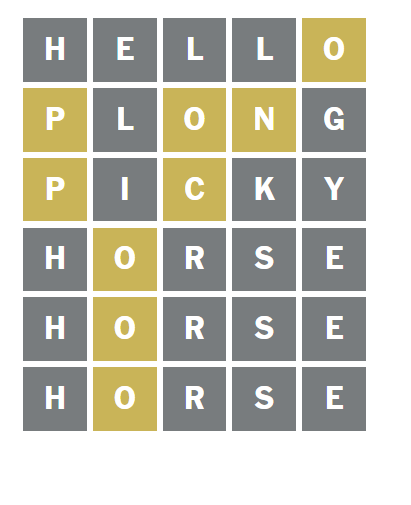

# Jonah2IT-Markdown-Learning
Lærer Markdown - **Jonah 2IT (2026)**

## Nummer 1 - Headers

For å bruke headers i ***TypeScript*** så kan du bruke # for H1, ## for H2, ### for H3.

## Nummer 2 - Kursiv og Bold tekst

Om jeg vil skrive i *Kursiv* eller **BOLD** bruker jeg * på starten og slutten av teksten til å skrive i kursiv, derimot brukeg jeg ** på starten og slutten til å skrive i bold.

## Nummer 3 - Hyperlinks
[Jonah sin Github](https://www.github.com/jonahaleksander/) <-- Her er min Github side for eksempel! for dette brukte [Tittel] (Lenke) (fjern mellomrom mellom tittel og lenke)

## Nummer 4 - Lister
- Dette 
- Er
- en
- liste
1. Dette 
2. Er
3. også
4. en
5. liste
6. men
7. med
8. tall

## Nummer 5 - Bilder

Dette er en helt basic bilde: 

Dette er en klikkbar bilde som tar deg til wordle nettsida

